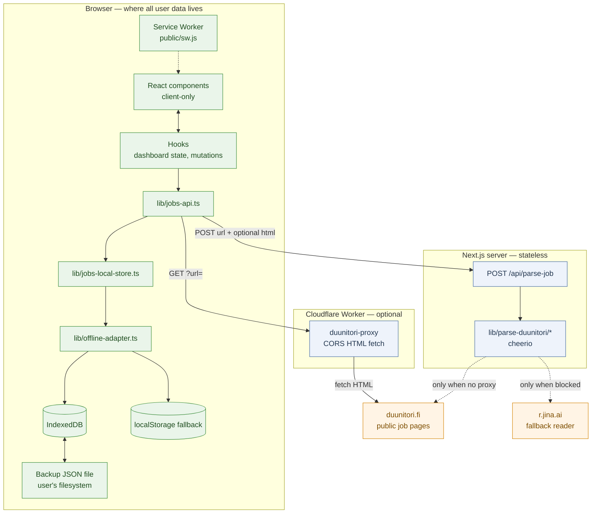
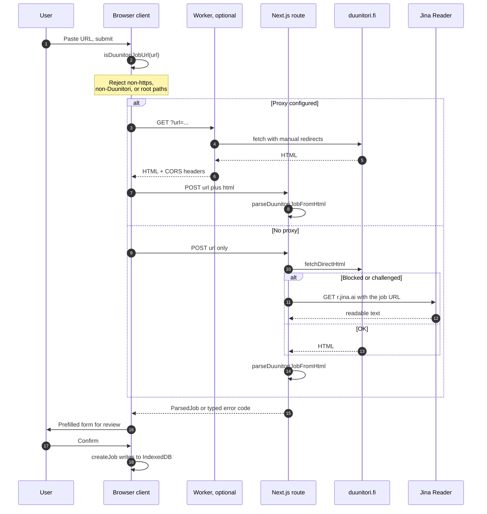
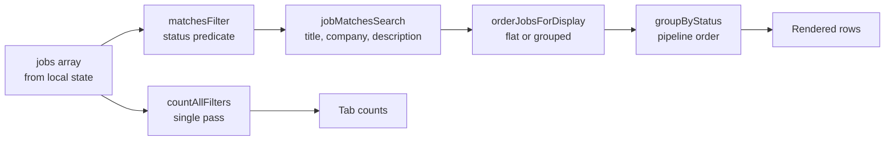
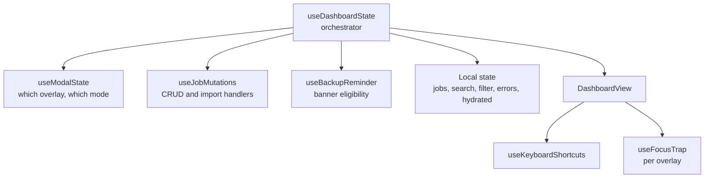
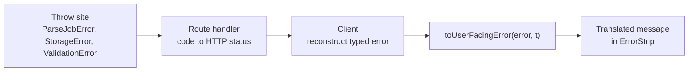

# Architecture

Technical reference for Duunitracker. This document explains how the system is put together and, where the reasoning is not obvious from the code, why. For setup and contribution basics, see [README.md](README.md).

## Contents

- [Design principles](#design-principles)
- [System topology](#system-topology)
- [The data boundary](#the-data-boundary)
- [Layers](#layers)
- [Import pipeline](#import-pipeline)
- [Storage layer](#storage-layer)
- [Filter pipeline](#filter-pipeline)
- [State management](#state-management)
- [Component architecture](#component-architecture)
- [Error handling model](#error-handling-model)
- [Internationalization](#internationalization)
- [Theming](#theming)
- [Accessibility](#accessibility)
- [Testing strategy](#testing-strategy)
- [Extension points](#extension-points)
- [Constraints and limits](#constraints-and-limits)

---

## Design principles

Five constraints shape every decision in the codebase. When a change conflicts with one of these, the change is wrong.

1. **The browser is the database.** Job data is created, read, updated, and deleted in IndexedDB (with a localStorage fallback). No server-side persistence exists, so there is no server-side copy to protect.
2. **The server is a pure function.** The single API route takes a URL or HTML and returns parsed fields. It is stateless and holds nothing between requests.
3. **Storage is untrusted input.** A local document can be hand-edited, half-written, or produced by an older version. Everything read from storage passes through validation.
4. **Types are shared, never duplicated.** One definition in `types/`, imported by the UI, the hooks, and the route handler alike.
5. **Failures are surfaced, never swallowed.** Every error path terminates in a typed error code that maps to a translated, user-facing message.

---

## System topology



Green holds user data and never transmits it. Blue is stateless and holds nothing. Amber is external and only ever receives a public job URL.

### Routes

| Route | File | Type |
|---|---|---|
| `/` | `app/page.tsx` | Marketing landing page |
| `/app` | `app/app/page.tsx` | The tracker dashboard |
| `/privacy` | `app/privacy/page.tsx` | Privacy policy, rendered from the i18n catalog |
| `POST /api/parse-job` | `app/api/parse-job/route.ts` | The only route handler in the app |
| `/manifest.webmanifest` | `app/manifest.ts` | PWA manifest, `start_url` is `/app` |
| `/offline` | `app/offline/page.tsx` | Cached fallback when a navigation fails |
| `/sw.js` | `public/sw.js` | Service worker: SWR for assets, network-first for parsers |
| `/robots.txt` | `app/robots.ts` | Allows `/`, disallows `/api/` |
| `/sitemap.xml` | `app/sitemap.ts` | The three public pages |
| `/icon`, `/opengraph-image` | `app/icon.tsx`, `app/opengraph-image.tsx` | Generated at build time |

---

## The data boundary

The single most important property of this architecture is which operations cross the network. The table is short because almost none of them do.

| Operation | Network | Server-side persistence |
|---|---|---|
| Read jobs on load | No | None |
| Create, update, delete a job | No | None |
| Edit notes, change status | No | None |
| Filter and search | No | None |
| Export backup | No — a file download | None |
| Import backup | No — a local file read | None |
| Change theme or locale | No | None |
| **Import from a Duunitori link** | **Yes** | **None — transient** |

The import path is the only exception, and it carries exactly one piece of information: a public Duunitori URL. The response is parsed fields, which the browser stores locally. The server writes nothing.

### Why `lib/jobs-api.ts` looks like a network client

The functions are named `createJobRequest`, `updateJobRequest`, `deleteJobRequest` and are `async`, which reads like HTTP. They are not:

```typescript
export async function createJobRequest(
  payload: CreateJobInput,
): Promise<JobApplication> {
  return createJob(payload);   // synchronous localStorage write
}
```

The async signature is a deliberate seam. Call sites already handle promises and errors, so introducing an optional sync backend later would not require touching the UI. Only `parseJobFromUrl` in this module actually performs `fetch`.

---

## Layers

Dependencies point in one direction: `types` ← `lib` ← `hooks` ← `components`. Nothing in `lib/` imports React.

```
types/          Shared type definitions. No logic, no dependencies.
  job.ts        JobApplication, ParsedJob, JobStatus, WorkType, form and input types
  attachment.ts JobAttachmentMeta, backup payloads, AttachmentKind
  parse-job.ts  ParseJobErrorCode union
  storage.ts    StorageErrorCode union
  backup.ts     JobsBackupDocument, JOBS_SCHEMA_VERSION
  locale.ts     Locale union, DEFAULT_LOCALE
  pwa.ts        BeforeInstallPromptEvent
  offline-store.ts OfflineStore adapter port

lib/            Framework-agnostic logic. Pure where possible, testable everywhere.
  parse-duunitori/  URL validation, fetching, JSON-LD, HTML fallback, text, errors
  i18n/             Typed message catalogs and lookup helpers
  seo/              Metadata construction
  jobs-local-store  Job CRUD, backup serialization, corruption handling
  offline-adapter   IndexedDB with localStorage fallback and schema migrations
  idb/              IndexedDB open, migrations, job/attachment/meta repositories
  browser-storage   Low-level localStorage access with typed errors
  storage-migration Legacy key migration
  jobs-api          Client-facing job operations and the parse fetch
  job-schema        Zod schemas: strict and lenient
  job-insights      Filtering, searching, grouping, counting
  job-validation    Create/update validation and status side effects
  job-status*       Status ordering and visual styles
  format            Finnish date parsing, display formatting, HTML to text
  validate          ValidationError, isRecord, safe URL guards
  keyboard          Arrow-key index math for roving-focus widgets
  site-config       Every constant: keys, limits, timeouts, thresholds
  backup-reminder   Reminder eligibility logic
  user-facing-errors Typed error to translated message mapping
  pwa/              Service worker registration and install-prompt helpers

hooks/          Client state. React-dependent, UI-agnostic.
components/     Presentation. Client-only.
workers/        Standalone Cloudflare Worker package, deployed separately.
tests/          Vitest suites for domain logic.
```

### Why `lib/site-config.ts` centralizes constants

Storage keys, size caps, timeouts, and reminder thresholds all live in one file. Storage keys in particular are load-bearing: a typo in a key string does not fail the build, it silently orphans a user's data. Defining each key once means the compiler catches mistakes that would otherwise be invisible until someone lost their job list.

---

## Import pipeline

The import path is the most intricate part of the system, because it depends on a third-party site that actively resists automated fetching.

### Sequence



### Stage 1 — URL validation

`lib/parse-duunitori/url.ts` is the trust gate, and it runs in the browser *and* again on the server. It is the reason this route cannot be used as an open proxy:

```typescript
export function isDuunitoriJobUrl(url: string): boolean {
  try {
    const parsed = new URL(url);
    if (parsed.protocol !== "https:") return false;
    if (!isDuunitoriHost(parsed.hostname)) return false;
    if (parsed.username || parsed.password) return false;
    const path = parsed.pathname;
    if (!path || path === "/") return false;
    return true;
  } catch {
    return false;
  }
}
```

HTTPS only, host must be `duunitori.fi` or a subdomain, no embedded credentials, and a non-root path. The check is re-applied after every redirect hop, so a redirect cannot walk the fetcher off-domain.

### Stage 2 — Fetching

Three strategies, tried in order of preference, all in `lib/parse-duunitori/fetch.ts` (and mirrored in the Worker).

| Strategy | Runs in | When |
|---|---|---|
| Worker proxy | Cloudflare edge | `NEXT_PUBLIC_DUUNITORI_PROXY_URL` is set. Preferred in production. |
| Direct fetch | Next.js server | No proxy configured. Normal path in local development. |
| Jina Reader | Next.js server | Direct fetch returns a challenge page, empty body, or HTTP 403/429/503. |

Every fetch path enforces the same rules: manual redirect handling capped at 5 hops with re-validation, a browser-like `User-Agent` and `Accept-Language: fi-FI,fi;q=0.9,en;q=0.8`, `cache: "no-store"`, a 1,500,000-character response cap, and a 15-second timeout server-side (20 seconds for the whole client-side operation, which includes the proxy hop).

Cloudflare interstitials are detected by content rather than status code, because they are served as HTTP 200:

```typescript
export function isBlockedChallengePage(html: string): boolean {
  return /Just a moment|cf-browser-verification|challenge-platform|Attention Required/i.test(
    html,
  );
}
```

**Why the Worker exists.** Duunitori is behind Cloudflare, which challenges datacenter IPs — Vercel's included. Fetching from the user's own browser through an edge Worker sidesteps this: the Worker is only needed because a browser cannot fetch `duunitori.fi` cross-origin without CORS headers. The result is that in production the Next.js server never contacts Duunitori at all; it only parses HTML handed to it.

### Stage 3 — Parsing

Two extractors run over the same HTML and their results are merged. Both are wrapped so that a failure in either does not abort the import.

**JSON-LD first** (`lib/parse-duunitori/json-ld.ts`). Duunitori embeds schema.org `JobPosting` metadata in `<script type="application/ld+json">`. This is structured, stable, and preferable to scraping. The extractor flattens `@graph` and array wrappers, matches on `@type` of `JobPosting` or `https://schema.org/JobPosting`, and reads `title`, `hiringOrganization.name`, `jobLocation`, `validThrough`, and `description`.

**HTML fallback second** (`lib/parse-duunitori/html-fallback.ts`). Tries `og:title` and `<title>` (splitting on the site's ` - ` separator and stripping the `Työpaikat - Duunitori` suffix), then `<h1>`, then a list of company and location selectors, then Finnish deadline patterns — `hakuaika`, `haku päättyy`, `viimeinen hakupäivä` — against body text. Description falls back to the longest candidate block over 80 characters.

**Merge priority** is per-field, based on which source is empirically more reliable for that field:

| Field | Priority | Reasoning |
|---|---|---|
| `title` | HTML → JSON-LD → `"Unknown title"` | Page markup is usually cleaner than the metadata copy. |
| `company` | HTML → JSON-LD → `"Unknown company"` | Same. |
| `location` | JSON-LD → HTML | Structured location data is far more consistent. |
| `deadline` | JSON-LD → HTML | `validThrough` is a real date; regex on Finnish prose is a guess. |
| `description` | JSON-LD → longest HTML block | Metadata description is already clean text. |

If both title and company are missing after the merge, the import fails with `unparseable` rather than saving a useless record. Everything else degrades to `null` and can be filled in by hand.

---

## Storage layer

### Document format

`localStorage["duunitracker-jobs"]` is only a migration source. The live store is IndexedDB database `duunitracker`, with object stores `jobs`, `attachments`, and `meta`. Exported backups still use a JSON envelope:

```typescript
export const JOBS_SCHEMA_VERSION = 2;

export type JobsBackupDocument = {
  schemaVersion: number;
  exportedAt?: string;   // set on export only
  jobs: JobApplication[];
  attachments?: JobAttachmentBackup[];
};
```

The same shape is used for the stored document and for exported files. One format means the import path and the read path share validation code, and an exported backup is literally the stored document plus a timestamp.

### The job record

```typescript
export type JobApplication = {
  id: string;
  url: string;
  title: string;
  company: string;
  location: string | null;
  deadline: string | null;
  applied: boolean;
  status: JobStatus;
  notes: string;
  dateApplied: string | null;
  interviewDate: string | null;
  contactName: string | null;
  contactEmail: string | null;
  salary: string | null;
  workType: WorkType | null;
  description: string | null;
  createdAt: string;
  updatedAt: string;
};
```

Optional fields are `T | null` rather than `T | undefined`, so the JSON round-trip is lossless — `undefined` disappears through `JSON.stringify`, `null` survives.

Status and work type derive their unions from const arrays, which makes the set of valid values available at runtime for validation and iteration:

```typescript
export const JOB_STATUSES = [
  "Saved", "Applied", "Interview", "Rejected", "Offer",
] as const;
export const WORK_TYPES = ["Remote", "Hybrid", "On-site"] as const;

export type JobStatus = (typeof JOB_STATUSES)[number];
export type WorkType = (typeof WORK_TYPES)[number];
export type JobListFilter = JobStatus | "All" | "InProgress";
```

`JobListFilter` extends the status union with two view-only values. `InProgress` is a composite over `Interview` and `Offer` and is never persisted on a record — it exists only as a filter.

### Derived field consistency

`status`, `applied`, and `dateApplied` are three representations of overlapping facts, so they can contradict each other. `lib/job-validation.ts` keeps them reconciled at the write boundary rather than leaving it to each call site:

- Setting status to `Applied` sets `applied: true` and stamps `dateApplied` with today, unless a date already exists or the patch supplies one explicitly.
- Setting any other status clears `applied`, while leaving `dateApplied` as a historical record.
- Ticking the applied checkbox on a `Saved` job promotes it to `Applied`; unticking it on an `Applied` job demotes it back to `Saved`. Other statuses are left alone, because an interview or an offer implies you applied regardless of the checkbox.
- An explicit status on the same patch always wins over an inferred one.

Centralizing this is what lets the row popover, the checkbox, and the edit form all mutate status without three subtly different behaviours. `tests/job-status.test.ts` covers these rules directly.

### Strict and lenient validation

`lib/job-schema.ts` deliberately defines two schemas for the same entity.

**`jobApplicationSchema` (strict)** guards writes, imports, and exports. Malformed data is rejected, because letting it in would corrupt the store.

**`storedJobSchema` (lenient)** guards reads from IndexedDB and leftover localStorage. It coerces and repairs rather than rejecting. The reasoning: a user's stored job is irreplaceable, and dropping a record because one enum drifted or one date is malformed is a worse outcome than keeping a slightly-wrong record they can fix in the UI.

The two modes disagree about `schemaVersion` on purpose, and the asymmetry is the interesting part. `extractBackupJobs(raw, mode)` **rejects** a newer-than-current version in strict mode — importing a file written by a future version could silently drop fields this build does not know about. In lenient mode it **accepts** it, because that document is the user's own local data, possibly written by a newer deploy they visited before a rollback. Refusing to read it would look identical to data loss.

Import also accepts a bare `JobApplication[]` with no envelope, for backups exported before the versioned document existed.

Reads report what happened. `readJobsDetailed()` returns both the recovered jobs and a count of records it could not salvage, which the dashboard surfaces as a warning instead of failing silently. Both `replaceJobs` and `parseJobsImport` return jobs newest-first by `updatedAt`, so ordering is established at the storage boundary rather than recomputed in the view.

### Corruption handling

If the document cannot be parsed at all, or every record fails validation:

1. The raw string is copied to `duunitracker-jobs-unreadable`, untouched.
2. A `refuseOverwriteCorrupted` flag is set, blocking further writes for the session.
3. The UI reports a `corrupted` storage error.

Step 2 is the important one. Without it, the app would treat the store as empty, and the user's first edit would overwrite recoverable data with a one-item list. Refusing to write keeps the door open for manual recovery from the side key.

Typed storage failures come from `types/storage.ts`: `"quota"`, `"unavailable"`, `"corrupted"`, `"overwrite_blocked"`. `lib/browser-storage.ts` also exposes "soft" variants (`readStorageItemSoft`, `writeStorageItemSoft`) for non-critical values like theme and locale, where a storage failure should be shrugged off rather than shown to the user.

### Migration

`lib/storage-migration.ts` runs `ensureStorageMigrated()` once per page load, before the first job read. It copies the pre-rebrand keys `job-tracker-jobs` and `job-tracker-theme` to their `duunitracker-*` equivalents. Locale and backup-reminder keys are not migrated because they did not exist under the old branding.

On first IndexedDB open, `lib/offline-adapter.ts` copies `duunitracker-jobs` from localStorage into the `jobs` object store, then removes the localStorage key. Theme, locale, and reminder preferences stay in localStorage — they are small and needed before React hydrates.

IndexedDB object-store shape is versioned separately (`IDB_SCHEMA_VERSION`). Adding a store or index means appending a numbered migration in `lib/idb/migrations.ts`.

**If you change the storage format**, the contract is: bump `JOBS_SCHEMA_VERSION` for backup envelopes, bump `IDB_SCHEMA_VERSION` for object stores, add an upgrade path from every previously shipped version, and never assume a stored document matches the current version. Users cannot be asked to run a migration script — their data is on their machine and the upgrade has to be invisible.

### Limits

From `lib/site-config.ts`, chosen to keep a pathological document from exhausting the storage quota:

| Limit | Value |
|---|---|
| Stored jobs | 5,000 |
| Backup import file | 25 MB |
| Attachment per file | 8 MB |
| Attachments per job | 8 |
| Fetched HTML | 1,500,000 characters |
| Notes / description per job | 50,000 / 100,000 characters |
| Server parse timeout | 15 s |
| Client parse timeout | 20 s |

### Backup reminders

`lib/backup-reminder.ts` decides whether to show the banner. All three conditions must hold: at least 5 jobs, at least 5 more jobs than at the last export or dismissal, and at least 7 days since that acknowledgement. The compound rule exists so the banner is useful without becoming the kind of nag people learn to dismiss reflexively.

---

## Filter pipeline

`lib/job-insights.ts` is pure and fully tested. It is the clearest example of the layering: no React, no storage, just functions over arrays.



Two details worth knowing:

**Counts are computed in one pass.** `countAllFilters` returns a `Record<JobListFilter, number>` from a single traversal, rather than the tab strip calling `countByFilter` seven times. With seven tabs re-rendering on every keystroke, the naive version is seven full scans per character typed.

**Display order and keyboard order are the same array.** `orderJobsForDisplay(jobs, grouped)` returns rows in exactly the sequence they appear on screen. `j`/`k` navigation walks that array, so keyboard movement matches what the eye sees even when grouping reorders rows.

`deriveBrandStatus` supplies the small status dot in the header, with offers outranking interviews — an at-a-glance signal of the best current state of the pipeline.

---

## State management

No state library. React state, composed through hooks, is sufficient for a single-view app whose data source is synchronous.



### `useDashboardState`

The single orchestrator. It owns `jobs`, `search`, `statusFilter`, `activeRowId`, `commandBarOpen`, `error`, and the `hydrated`, `importing`, and `saving` flags, then composes the other hooks and returns one flat object that `DashboardView` spreads into its children.

`hydrated` exists because IndexedDB is unavailable during server rendering. The first client render has no jobs; `hydrated` distinguishes "still loading" from "genuinely empty" so the empty state does not flash on every load.

### `useModalState`

Tracks `createModalOpen`, `createMode` (`"import" | "manual"`), `createDraft`, `panelJobId`, and `panelMode` (`"overview" | "edit"`).

The detail panel stores a job **id**, not a job object. A copied object would go stale the moment the underlying job changed, so the panel would show old values after an inline edit. Holding the id and deriving `panelJob` from the current `jobs` array keeps the panel consistent by construction.

### `useJobMutations`

All writes, in one place: `handleImport`, `handleCreateJob`, `handleUpdateJob`, `handleEditSave`, `handleDelete`, `handleAddManual`. Each wraps its `lib/jobs-api.ts` call in `try`/`catch`, types the caught value as `unknown`, and routes it through `toUserFacingError` before setting error state. Setters are injected by `useDashboardState` rather than the hook owning state, which keeps a single source of truth for `jobs`.

### `useFocusTrap`

Shared accessibility behaviour for the three overlays. Given `{ enabled, containerRef, onClose, lockScroll }` it focuses the first input on open, cycles `Tab` within the container, closes on `Escape`, restores focus to the previously focused element on unmount, and optionally locks body scroll.

### `useKeyboardShortcuts`

Global `keydown` listener, disabled via its `enabled` flag whenever a modal owns the keyboard. It ignores events originating from inputs, textareas, selects, and contenteditable elements — except `Escape`, which blurs the field. `Cmd`/`Ctrl` + `K` is handled before the enabled check, so search is reachable from anywhere.

---

## Component architecture

```
RootLayout (ThemeProvider → LocaleProvider)
├── / ......... LandingPage → LandingHero → LandingPreview, LandingSteps, LandingStickyCta, LandingJsonLd
└── /app ...... Dashboard → DashboardView
                ├── AppHeader ......... search, import/add, DataBackupControls, switchers, brand dot
                ├── ErrorStrip ........ dismissible global error bar
                ├── BackupReminderBanner
                ├── InstallPromptBanner (root layout)
                ├── StatusTabs ........ filter tabs with counts
                ├── JobList
                │   ├── EmptyState .... empty vs no-match, with skeleton rows
                │   ├── JobGroup ...... sticky status headers when grouped
                │   └── JobRow ........ PipelineRail, StatusPopover, NotesField, DeadlineTag, Tag
                ├── SiteFooter
                ├── CommandBar ........ URL import overlay
                ├── DetailPanel ....... slide-over, overview and edit modes
                └── JobFormModal ...... create, import or manual mode
```

`Dashboard` is a thin client wrapper — it calls `useDashboardState()` and spreads the result into `DashboardView`. Splitting them keeps the state wiring separate from the layout, so `DashboardView` is a function of props alone.

Form fields are shared rather than duplicated. `JobFormPrimaryFields` (url, title, company, location, deadline, description) and `JobFormTrackingFields` (applied, status, dates, work type, salary, contact, notes) are used by both `JobFormModal` and `DetailPanel`'s edit mode, so a new field appears in both places from one edit.

`components/job-list/types.ts` defines a `JobListHandlers` type carrying the row callbacks, so the handler set travels as one prop through `JobList` to `JobRow` instead of being threaded individually.

---

## Error handling model

Errors are typed unions from the moment they are created to the moment they are rendered. There is no stringly-typed error handling and no place where an error is caught and dropped.

### Error classes

| Class | Module | Codes |
|---|---|---|
| `ParseJobError` | `lib/parse-duunitori/errors.ts` | `invalid_url`, `invalid_request`, `timeout`, `network`, `blocked`, `invalid_html`, `unparseable`, `too_large`, `redirect` |
| `StorageError` | `lib/browser-storage.ts` | `quota`, `unavailable`, `corrupted`, `overwrite_blocked` |
| `ValidationError` | `lib/validate.ts` | Optional string code, used for import and write failures: `invalid_json`, `invalid_shape`, `invalid_schema`, `unsupported_version`, `empty`, `too_large` |

### Flow



The route maps codes to statuses: 400 for `invalid_url` and `invalid_request`, 504 for `timeout`, 502 for the fetch and parse failures, 500 otherwise. The client reads `{ error, code }` from the body and, if the code is recognized by the `isParseJobErrorCode` guard, rebuilds a real `ParseJobError` — so the error keeps its type across the network boundary instead of degenerating into a string.

`lib/user-facing-errors.ts` is the final hop. `toUserFacingError(error, t, fallback)` narrows by error class and code and returns a translated message, with a generic fallback for anything unrecognized. This is why no user ever sees a raw exception message, and why error copy is translated like any other string.

---

## Internationalization

```typescript
export const LOCALES = ["fi", "en"] as const;
export type Locale = (typeof LOCALES)[number];
export const DEFAULT_LOCALE: Locale = "fi";
```

Finnish is the default — the app tracks Finnish job postings for a Finnish job board.

A single `Messages` interface in `lib/i18n/types.ts` describes the entire catalog as nested sections (`meta`, `landing`, `privacy`, `app`, `filters`, `list`, `form`, `errors`, and so on). Some sections are typed against other domain types — `status` is a `Record<JobStatus, string>`, so adding a job status is a compile error until both locales have a label for it.

Each locale is split by concern and reassembled:

```typescript
export const en: Messages = {
  ...enCommon,
  form: enForm,
};
```

The per-file exports are typed with `Pick<Messages, ...>`, so a missing or misspelled key fails the build rather than rendering `undefined`.

`formatTemplate(template, values)` handles interpolation with `{key}` placeholders. `statusLabel` and `workTypeLabel` are typed lookups for enum values.

`LocaleProvider` holds the active locale and the resolved `t` catalog in context, persists the choice to `duunitracker-locale`, and keeps `document.documentElement.lang` in sync.

---

## Theming

Tailwind CSS v4 with no config file. `app/globals.css` is the entry point: `@import "tailwindcss"` followed by CSS custom properties for both palettes, selected by a `data-theme` attribute on `<html>`.

Theme and locale are applied by an inline script in `<head>`, before React hydrates:

```javascript
var stored = localStorage.getItem(key) || localStorage.getItem(legacyKey);
var theme = stored === "light" || stored === "dark" ? stored : "light";
document.documentElement.setAttribute("data-theme", theme);
```

The server cannot know the user's stored preference, so any approach that waits for React produces a visible flash of the wrong theme. A blocking inline script is the one place in this codebase where `dangerouslySetInnerHTML` is justified: the content is a build-time constant with no user input. The same script sets `lang` from the stored locale, and `suppressHydrationWarning` on `<html>` accounts for the attributes it changes.

---

## Accessibility

- **Overlays** use `useFocusTrap` for focus containment, initial focus, `Escape` to close, and focus restoration on close.
- **Roving focus widgets** (status tabs, theme and language switchers, the status popover) share `nextIndexOnArrowKey` from `lib/keyboard.ts`, so arrow, `Home`, and `End` behave identically across all of them.
- **Keyboard shortcuts** never fire while the user is typing, which keeps single-letter shortcuts from corrupting input.
- **Status is never colour-only.** Status dots pair colour with shape — a ring for `Saved`, a fill for active statuses — and every row carries a text label.
- **Deadline urgency** is conveyed by both text and styling, not animation alone.

---

## Testing strategy

Vitest in a Node environment. `vitest.config.mts` includes `tests/**/*.test.ts`, aliases `@` to the repo root, and excludes `workers/` since the Worker is a separate package.

Node is the default because most of the domain layer is pure. Suites that need `localStorage` opt into jsdom per file with a pragma rather than making everything slower:

```typescript
/** @vitest-environment jsdom */
```

Shared fixtures live in `tests/helpers/job.ts` (`createTestJob`), which builds a valid `JobApplication` with overrides — so a test that cares about one field does not have to spell out eighteen.

Coverage is concentrated where a silent regression would cost a user their data:

| Suite | Covers |
|---|---|
| `tests/job-filters.test.ts` | Status filtering, the composite `InProgress` filter, search matching, tab counts |
| `tests/job-status.test.ts` | Status transitions and their side effects on derived fields |
| `tests/jobs-backup.test.ts` | Backup serialization, import parsing, schema validation, malformed records, localStorage → IndexedDB migration |
| `tests/attachments.test.ts` | Attachment persistence, replace-in-place, cascade delete |
| `tests/idb-migrations.test.ts` | IndexedDB migration registry |

This is a deliberate prioritization rather than a claim of thoroughness. The filter pipeline and the storage layer are pure functions with high consequence — a filter bug hides jobs, a serialization bug destroys them — so they are tested first. There are no component or end-to-end tests yet; UI regressions are currently caught by hand.

If you are adding tests, the highest-value gaps are the parsing merge logic in `lib/parse-duunitori.ts` (against saved HTML fixtures) and the lenient read path in `lib/job-schema.ts` (against deliberately damaged documents).

---

## Extension points

### Adding a job status

1. Add the value to `JOB_STATUSES` in `types/job.ts`.
2. Follow the compiler. The `Record<JobStatus, string>` in `Messages` and the style and order maps in `lib/job-status-styles.ts` will all fail to build until updated.
3. Decide whether `JOB_LIST_FILTERS` should expose it as a tab, and whether the `IN_PROGRESS` composite should include it.
4. Consider migration: existing stored jobs will not have the new status, which is fine — but removing or renaming a status requires an upgrade path.

### Adding a tracked field

1. Add it to `JobApplication` in `types/job.ts`, as `T | null` if optional.
2. Extend both schemas in `lib/job-schema.ts`, and add a length cap to `JOB_FIELD_LIMITS` for text fields.
3. Add the input to `JobFormPrimaryFields` or `JobFormTrackingFields` — both consumers pick it up automatically.
4. Add labels to both locales.
5. Old records will lack the field. The lenient read schema must supply a default rather than reject them.

### Supporting another job board

The parser is deliberately factored so that this does not require rewriting the app:

1. Add a `lib/parse-<site>/` module with its own `url.ts` guard and extractors, mirroring the JSON-LD-first, HTML-fallback shape.
2. Dispatch by hostname in the route handler.
3. Reuse `ParseJobError` and its codes — the error taxonomy is site-agnostic.
4. Storage, filtering, and the UI need no changes, since they only know about `ParsedJob`.

### Adding a locale

1. Extend `LOCALES` in `types/locale.ts`.
2. Create `lib/i18n/messages/<locale>/` with `common.ts` and `forms.ts`, and assemble them into a `Messages` object. The type will list everything you are missing.
3. Register it in `getMessages` and add it to `LanguageSwitcher`.

---

## Constraints and limits

Consequences of the architecture, stated plainly so nobody has to rediscover them.

| Constraint | Why it exists |
|---|---|
| No cross-device sync | Sync requires a server-side copy, which is the one thing this design refuses. |
| Data lost when site data is cleared | The browser owns the only copy. Mitigated by export and the reminder banner. |
| Storage is per-origin | A different domain is a different store. Moving domains means exporting and importing. |
| ~5,000 job ceiling | Practical headroom for a personal search, including attachments. Far above any realistic personal job search. |
| Synchronous storage blocks the main thread | Job writes are async IndexedDB transactions. Preference keys remain synchronous localStorage. |
| Import replaces, does not merge | Merging needs duplicate resolution rules that would be guesswork. |
| Parsing depends on Duunitori's markup | Any HTML scraper inherits its source's markup. JSON-LD-first reduces the exposure; manual editing covers the rest. |
| Server needed for imports | Browsers cannot fetch Duunitori cross-origin. The server stays stateless and parse-only. |
