# Duunitracker

A privacy-first job application tracker for [Duunitori.fi](https://duunitori.fi) postings. Paste a job link, get the posting parsed into a structured record, then track status, deadlines, and notes — entirely inside your own browser.

No accounts. No database. No application data on any server.

**Stack:** Next.js 16 · React 19 · TypeScript (strict) · Tailwind CSS v4 · Zod · Vitest

---

## Table of contents

- [Privacy-first architecture](#privacy-first-architecture)
- [How it works](#how-it-works)
- [Features](#features)
- [Getting started](#getting-started)
- [Environment variables](#environment-variables)
- [Scripts](#scripts)
- [Running tests](#running-tests)
- [Tech stack decisions](#tech-stack-decisions)
- [Keyboard shortcuts](#keyboard-shortcuts)
- [Your data](#your-data)
- [Deployment](#deployment)
- [Contributing](#contributing)

---

## Privacy-first architecture

Duunitracker is built so that there is no server-side copy of your job search to leak, subpoena, or sell. This is a structural property of the app, not a policy promise.

| Concern | How it is handled |
|---|---|
| **Where your jobs live** | IndexedDB in your browser (`duunitracker`), with a localStorage fallback. Nothing else. |
| **Database** | None. There is no ORM, no hosted DB, no persistence layer on the server. |
| **Accounts / auth** | None. There is nothing to sign in to, so there is no identity to correlate your data with. |
| **CRUD over the network** | Zero. Create, update, delete, and read are local IndexedDB operations. |
| **What the server ever sees** | Only a public Duunitori URL (and optionally the public HTML of that page) during an import. Parsed fields are returned to your browser and immediately discarded server-side. |
| **Notes, contacts, salary** | Never transmitted. These fields exist only in your browser and in backups you export yourself. |
| **Third-party tracking** | No advertising, session-recording, or behavioural trackers. See the caveat below. |
| **Data portability** | JSON export/import, versioned with an explicit `schemaVersion`, so your data is never held hostage by the app. |

**One honest caveat:** the deployed site includes [Vercel Analytics](https://vercel.com/docs/analytics) for anonymized, cookieless pageview counts. It never receives application data. If you self-host and want a completely third-party-free build, delete the `<Analytics />` element from `app/layout.tsx` and drop the `@vercel/analytics` dependency — nothing else depends on it.

**The trade-off you should know about:** because there is no server-side copy, clearing site data, using private browsing, or switching browsers means losing your jobs. The app nudges you toward exporting a backup once your list grows past a handful of entries. Take the nudge seriously.

---

## How it works

The whole app is four stages: a link becomes a parsed record, the record lands in local state, local state is narrowed by the filter pipeline, and everything can be exported as a portable backup.

```mermaid
flowchart LR
    subgraph parse["1 · Link parsing"]
        direction TB
        A["Paste Duunitori URL"]
        B["URL guard<br/>https + duunitori.fi host"]
        C["Fetch public HTML<br/>Worker, server, or Jina fallback"]
        D["JSON-LD first,<br/>HTML fallback merged in"]
        E["ParsedJob"]
        A --> B --> C --> D --> E
    end

    subgraph state["2 · Local state"]
        direction TB
        F["Prefilled form,<br/>user reviews and confirms"]
        G["createJob validates<br/>with Zod"]
        H[("IndexedDB<br/>duunitracker")]
        I["jobs array in React state"]
        F --> G --> H --> I
    end

    subgraph filters["3 · Filter pipeline"]
        direction TB
        J["Status filter<br/>All, Saved, InProgress, ..."]
        K["Text search<br/>title, company, description"]
        L["Group and order<br/>by pipeline stage"]
        M["Rendered rows"]
        J --> K --> L --> M
    end

    subgraph backup["4 · Backup"]
        direction TB
        N["Serialize with schemaVersion"]
        O["duunitracker-backup.json"]
        P["Import into another browser"]
        N --> O --> P
    end

    E --> F
    I --> J
    H --> N
    P -.-> H

    classDef net fill:#fff4e5,stroke:#d68910,color:#7d4e00
    classDef local fill:#eaf5ea,stroke:#3f8f3f,color:#1f4d1f
    class C net
    class F,G,H,I,J,K,L,M,N,O,P local
```



Green nodes are entirely local — no data in them ever leaves your machine. The single amber node is the only step in the entire app that touches the network, and all it ever handles is a public job posting.

For the full picture — module boundaries, error taxonomy, schema migration, state composition — see [ARCHITECTURE.md](ARCHITECTURE.md).

---

## Features

- **Import from a link.** Paste a Duunitori job URL and get title, company, location, deadline, and description extracted automatically. Parsing prefers the page's schema.org `JobPosting` metadata and falls back to HTML scraping when it is missing.
- **Manual entry.** Any job can be added by hand, so the tracker is not useless for postings from other sources.
- **Pipeline tracking.** Five statuses — `Saved`, `Applied`, `Interview`, `Offer`, `Rejected` — plus a composite `InProgress` filter covering interviews and offers.
- **Rich per-job fields.** Applied flag, applied/interview dates, work type, salary, contact name and email, and free-form notes.
- **Deadline awareness.** Relative deadline badges that escalate visually when a posting closes within two days.
- **Keyboard-first navigation.** `j`/`k` row movement, `c` to import, `/` to search, `Enter` to open, `e` to edit.
- **Bilingual.** Finnish (default) and English, fully typed message catalogs.
- **Light and dark themes.** Applied before first paint, so there is no flash of the wrong theme.
- **Installable PWA.** Service worker, web app manifest, and an install banner. The tracker works offline after the first visit; importing a Duunitori link still needs the network.
- **Documents per application.** Store a CV PDF and a cover letter draft on each job, in IndexedDB.
- **Backup export/import.** Versioned JSON, including attachments, with a reminder banner that appears as your list grows.
- **Corruption resilience.** If the stored document ever becomes unreadable, the raw blob is preserved to a side key and further writes are blocked rather than silently overwriting your data.

---

## Getting started

**Prerequisites:** Node.js 20 or newer, and npm.

```bash
git clone https://github.com/FreddyRik/duunitracker.git
cd duunitracker
npm install
npm run dev
```

Open [http://localhost:3000](http://localhost:3000). The landing page is at `/` and the tracker itself at `/app`.

No environment variables are needed for local development. With no proxy configured, the `/api/parse-job` route fetches Duunitori directly from your machine, which normally works fine from a residential IP.

### First run

1. Go to `/app` and press `c` (or click **Import job**).
2. Paste a Duunitori job URL and submit.
3. Review the prefilled form — parsing is best-effort, so correct anything that looks wrong — and save.
4. Use the status popover on the row, or open the detail panel with `Enter`, to move the job through your pipeline.
5. Click **Export backup** whenever you have made progress worth keeping.

---

## Environment variables

Copy [`.env.example`](.env.example) to `.env.local` and fill in what you need. All of these are optional in development.

| Variable | Scope | Required | Purpose |
|---|---|---|---|
| `NEXT_PUBLIC_SITE_URL` | Client + server | Production | Canonical URL used for metadata, sitemap, robots, and OG images. Falls back to `VERCEL_URL`, then a hardcoded default. |
| `NEXT_PUBLIC_DUUNITORI_PROXY_URL` | Client | Production | Cloudflare Worker that fetches Duunitori HTML with CORS headers. When set, the browser fetches the page and the server only parses. |
| `JINA_API_KEY` | Server | No | Raises rate limits on the [Jina Reader](https://jina.ai/reader) fallback used when a direct server-side fetch is blocked. |

Changing any of these requires a restart locally and a redeploy in production, since `NEXT_PUBLIC_*` values are inlined at build time.

---

## Scripts

| Command | What it does |
|---|---|
| `npm run dev` | Start the development server on port 3000. |
| `npm run build` | Production build. Fails on type errors and lint errors. |
| `npm run start` | Serve the production build. Requires `npm run build` first. |
| `npm run lint` | ESLint with `eslint-config-next` (core-web-vitals + TypeScript rules). |
| `npm test` | Run the Vitest suite once. |
| `npm run test:watch` | Vitest in watch mode. |

---

## Running tests

Tests use [Vitest](https://vitest.dev) in a Node environment. The suite lives in `tests/` and covers the pure domain logic — the parts where a regression would silently corrupt or lose data.

```bash
npm test                        # whole suite, once
npm run test:watch              # re-run on change
npx vitest run tests/jobs-backup.test.ts   # single file
npx vitest run -t "filter"      # tests matching a name
```

Current coverage:

| File | Covers |
|---|---|
| `tests/job-filters.test.ts` | Status filtering, composite `InProgress` filter, search matching, tab counts. |
| `tests/job-status.test.ts` | Status transitions and the way `status`, `applied`, and `dateApplied` are kept consistent. |
| `tests/jobs-backup.test.ts` | Backup round-trips, import rejection paths (bad JSON, empty, oversized, unsupported version, invalid schema), validated writes, and localStorage → IndexedDB migration. |
| `tests/attachments.test.ts` | CV/cover-letter persistence, replace-in-place, and cascade delete. |
| `tests/idb-migrations.test.ts` | IndexedDB schema migration registry. |

Config is in `vitest.config.mts`: `tests/**/*.test.ts` is the include glob, `@` resolves to the repo root, and `workers/` is excluded because the Cloudflare Worker is a separate package.

Two conventions when adding tests: use `createTestJob` from `tests/helpers/job.ts` to build fixtures, and add `/** @vitest-environment jsdom */` plus `import "fake-indexeddb/auto"` at the top of any file that needs IndexedDB or `localStorage`, since the default environment is Node.

**What is not covered yet:** there are no component or end-to-end tests. If you are adding UI behaviour, the honest state of things is that you are the test. Contributions that add a component-testing setup are welcome — see below.

---

## Tech stack decisions

Each choice below follows from the privacy-first constraint. Documenting the reasoning so future changes do not accidentally undo it.

### Next.js 16 with the App Router

Chosen for static-quality landing pages, file-based metadata (`sitemap.ts`, `robots.ts`, `manifest.ts`, `opengraph-image.tsx`), and — critically — a single server route for the one operation that genuinely needs a server. The App Router's client/server split makes the data boundary legible: everything under `components/` and `hooks/` is client-side and cannot touch a server, and there is exactly one route handler in the entire app.

> This repo tracks a Next.js version whose APIs may differ from older releases. Consult `node_modules/next/dist/docs/` before reaching for remembered conventions.

### IndexedDB instead of a remote database

The feature set — a personal list of a few dozen to a few hundred job applications, plus CV PDFs and cover letter drafts — fits in the browser, and it is the only storage option that makes "your data never leaves your browser" literally true. IndexedDB replaces `localStorage` for jobs so attachments are not capped at a few megabytes. Preferences (theme, locale) stay in `localStorage` so they can be applied before React hydrates.

The store is capped at 5,000 jobs, 8 MB per attachment, and 25 MB backups, with per-field length limits.

### Zod for validation at every boundary

Storage is untrusted input. A JSON blob in `localStorage` can be edited by hand, corrupted by a crashed write, or produced by an older version of the app. Zod schemas guard every crossing, with a deliberate split:

- A **strict** schema for writes, imports, and exports — reject anything malformed.
- A **lenient** schema for reads from local storage — coerce damaged records back into shape instead of dropping a user's job because one field went wrong.

### TypeScript with a single source of truth for types

All shared types live under `types/`, and both the UI and the API route import the same definitions. Status values and work types are `as const` arrays that derive their union types, so adding a status is one edit that the compiler propagates. `any` is not used anywhere; unknown input is typed `unknown` and narrowed with guards or Zod.

Imports use the `@/` alias exclusively — no relative path traversal.

### Tailwind CSS v4

Zero-config via the PostCSS plugin, with no `tailwind.config.js`. Theme tokens are CSS custom properties in `app/globals.css`, toggled by a `data-theme` attribute on `<html>`. An inline script in the document head sets that attribute from `localStorage` before first paint, which is why there is no theme flash.

### cheerio for parsing

Server-side HTML parsing needs a real DOM-ish API without a browser. cheerio is small, synchronous, and jQuery-shaped, which suits a parser that has to try many selectors in sequence.

### A Cloudflare Worker for production fetches

Duunitori sits behind Cloudflare, which frequently challenges requests from datacenter IPs — including Vercel's. Rather than fighting that from the server, production configures an optional Worker: the browser fetches the public page through the Worker at the edge, then posts the HTML to `/api/parse-job` for parsing only. It is genuinely optional; without it, the server fetches directly and falls back to Jina Reader when blocked.

### Hand-rolled i18n

Two locales and a few hundred strings do not justify a runtime i18n library. A typed `Messages` interface with one object per locale gives compile-time completeness checking — a missing translation is a build error — at zero bundle cost.

---

## Keyboard shortcuts

Available on the dashboard when no modal is open. Shortcuts are suppressed while you are typing in an input.

| Key | Action |
|---|---|
| `c` | Open the import command bar |
| `/` | Focus search |
| `Cmd`/`Ctrl` + `K` | Focus search (works even inside modals) |
| `j` / `k` | Move to next / previous row |
| `Enter` | Open the active row's detail panel |
| `e` | Edit the active row |
| `Esc` | Close the current overlay, or blur the focused input |

---

## Your data

### Storage keys

Jobs and attachments live in IndexedDB (`duunitracker`). Preference keys stay in `localStorage`:

| Location | Contents |
|---|---|
| IndexedDB `jobs` | Your job applications, one record per id. |
| IndexedDB `attachments` | CV PDFs, cover letter drafts, and other files per job. |
| IndexedDB `meta` | Migration flags for the object-store schema. |
| `duunitracker-jobs` | Legacy JSON document, copied into IndexedDB on first load then removed. |
| `duunitracker-jobs-unreadable` | Raw blob preserved if the primary document ever fails to parse, so nothing is lost. |
| `duunitracker-theme` | `light` or `dark`. |
| `duunitracker-locale` | `fi` or `en`. |
| `duunitracker-backup-last-export-count` | Job count at last export, used to time the backup reminder. |
| `duunitracker-backup-reminder-dismissed-count` | Job count when you last dismissed the reminder. |
| `duunitracker-backup-reminder-ack-at` | Timestamp of the last export or dismissal. |
| `duunitracker-pwa-install-dismissed` | Timestamp of the last install-banner dismissal. |

Keys from the app's earlier `job-tracker-*` branding are migrated automatically on first load.

### Backups

Export produces a JSON file shaped like this:

```json
{
  "schemaVersion": 2,
  "exportedAt": "2026-08-15T12:00:00.000Z",
  "jobs": [{ "id": "...", "title": "...", "company": "...", "status": "Applied" }],
  "attachments": [{ "id": "...", "jobId": "...", "kind": "cv", "filename": "cv.pdf", "dataBase64": "..." }]
}
```

Import **replaces** everything currently stored in the browser, after a confirmation prompt. There is no merge — if you need one, export both browsers and combine the `jobs` arrays by hand.

The reminder banner appears once you have at least 5 jobs, then again after 5 more jobs and at least 7 days since your last export or dismissal.

### Things that will lose your data

- Clearing site data or cookies for the domain.
- Browser "clean up on exit" settings.
- Private/incognito windows, which discard storage on close.
- Switching browsers, devices, or profiles — storage is per-origin and per-browser.
- Deploying to a different domain, which is a different origin with different storage.

Export a backup first. The app cannot recover data it never had.

---

## Deployment

### Vercel

1. Import the repository at [vercel.com/new](https://vercel.com/new).
2. Set `NEXT_PUBLIC_SITE_URL` to your canonical URL.
3. Deploy, then deploy the Worker below and set `NEXT_PUBLIC_DUUNITORI_PROXY_URL`.
4. Redeploy — `NEXT_PUBLIC_*` variables are baked in at build time.

### Duunitori proxy Worker

Optional but recommended in production, because Duunitori's Cloudflare protection often blocks Vercel's IP ranges. Deployment instructions are in [`workers/duunitori-proxy/README.md`](workers/duunitori-proxy/README.md). The Worker only fetches public Duunitori pages and adds CORS headers; it holds no state and sees no user data.

---

## Contributing

Contributions are welcome. The bar is: keep the privacy model intact, keep types honest, and keep modules small.

### Setup

```bash
git clone https://github.com/FreddyRik/duunitracker.git
cd duunitracker
npm install
npm run dev
```

### Before opening a pull request

```bash
npm run lint
npm test
npm run build
```

All three must pass. `npm run build` is not redundant with `lint` — it is what surfaces type errors across the whole project.

### Conventions

These are enforced by review, and mostly by the compiler:

- **No `any`, no `as any`.** Type unknown input as `unknown` and narrow it with a type guard or a Zod schema.
- **Absolute imports only.** Use `@/lib/...`, never `../../lib/...`.
- **Types live in `types/`.** If a shape is shared between a component, a hook, and the API route, it belongs there and is imported by all three.
- **Small, focused modules.** Prefer a new file over a growing one. The parsing pipeline and the storage layer are both split by responsibility for exactly this reason.
- **Explicit async error handling.** Wrap external calls in `try`/`catch` with `unknown` error typing, and surface a structured, user-facing error state rather than failing silently.
- **Both locales, always.** Adding a string means adding it to `lib/i18n/messages/fi/` and `lib/i18n/messages/en/`. The `Messages` interface will fail the build if you forget.
- **Tests for domain logic.** Anything that filters, validates, migrates, or serializes user data needs a test in `tests/`.

### Guidance for common changes

| Change | Where to start |
|---|---|
| Add a job status | `types/job.ts` (`JOB_STATUSES`), then follow the compiler through styles, i18n, and filters. |
| Add a tracked field | `types/job.ts`, `lib/job-schema.ts`, then the form field components. |
| Change parsing behaviour | `lib/parse-duunitori/` — pick `json-ld.ts` or `html-fallback.ts` depending on the source of the field. |
| Add a locale | `types/locale.ts`, a new folder under `lib/i18n/messages/`, and the switcher component. |
| Touch storage format | Read the schema-versioning section of [ARCHITECTURE.md](ARCHITECTURE.md) first. Backward compatibility with existing users' data is not optional. |

### Reporting bugs

Open an issue at [github.com/FreddyRik/duunitracker/issues](https://github.com/FreddyRik/duunitracker/issues). For import failures, include the Duunitori URL — the posting's markup is usually the culprit, and the URL is the only way to reproduce it.

**Never paste a backup file into an issue.** It contains your notes, contacts, and salary information.

---

## Known limitations

- **Import is coupled to Duunitori's markup.** When a posting lacks JSON-LD and uses unusual markup, fields come back empty or wrong. Editing them by hand always works.
- **No cross-device sync.** By design. Export and import instead.
- **Import replaces rather than merges.** Deliberate, to avoid ambiguous duplicate resolution.
- **Descriptions saved by older versions stay as they were** until you re-import the job.
- **No component or end-to-end test coverage.** Domain logic is tested; the UI is not.

---

## License

No license file is currently included in this repository, which means the code is not licensed for reuse by default. If you intend to fork or redistribute, open an issue to ask about licensing.
